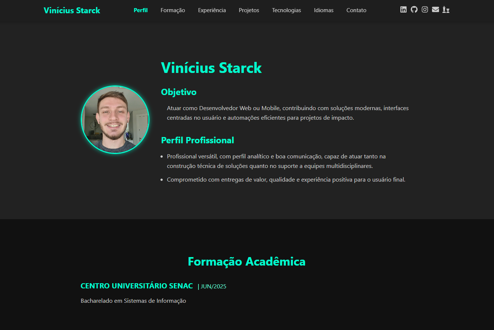

# 🚀 Portfólio | Vinícius Starck

Bem-vindo ao meu portfólio profissional de desenvolvimento web e mobile!  
Este projeto foi desenvolvido com foco em performance, responsividade e clareza para apresentar minhas experiências, habilidades e projetos de forma moderna e eficiente.

---

## 🧑‍💻 Sobre Mim

Olá! Sou **Vinícius Starck**, desenvolvedor com experiência em front-end e back-end, apaixonado por tecnologia, design centrado no usuário e soluções práticas que geram impacto real.

---

## 📌 Seções do Portfólio

- **Perfil** — Apresentação profissional com foto, objetivo e resumo das habilidades.
- **Formação Acadêmica** — Instituições, cursos e datas.
- **Experiência Profissional** — Experiências reais com foco em tecnologia e resultados.
- **Projetos** — Principais projetos com imagens, links e stacks utilizadas.
- **Competências Técnicas** — Stack de tecnologias, ferramentas e metodologias dominadas.
- **Idiomas** — Idiomas falados e seus níveis.
- **Contato** — Formulário funcional com integração via **EmailJS**.

---

## 🛠️ Tecnologias Utilizadas

- React.js
- CSS3 (customizado)
- HTML5
- Firebase Hosting (para deploy)
- EmailJS (para envio de mensagens)
- Git & GitHub
- Responsividade (Mobile First)
- Outras bibliotecas: `react-icons`, `emailjs-com`, etc.

---

## 🖼️ Imagem de Exemplo



---

## 🔗 Acesso

Você pode acessar o portfólio completo em:  
👉 [https://starck-portifolio.web.app/](https://starck-portifolio.web.app/)

---

## 📬 Contato

Caso queira entrar em contato diretamente:

- Email: starck.vinicius@gmail.com  
- LinkedIn: [https://linkedin.com/in/vinicius-starck](https://linkedin.com/in/vinicius-starck)  
- GitHub: [https://github.com/Vini-Starck](https://github.com/Vini-Starck)

---

## ⚙️ Como Rodar Localmente

```bash
# Clone este repositório
git clone https://github.com/Vini-Starck/portifolio.git

# Acesse a pasta
cd portifolio

# Instale as dependências
npm install

# Rode o projeto
npm start
```

---

## 📝 Licença

Este projeto está sob a licença MIT.
Sinta-se à vontade para utilizá-lo como base para o seu próprio portfólio (com os devidos créditos, se possível 😉).

## Feito com dedicação por Vinícius Starck 👨‍💻